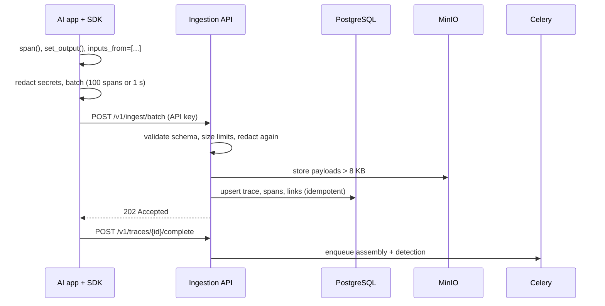
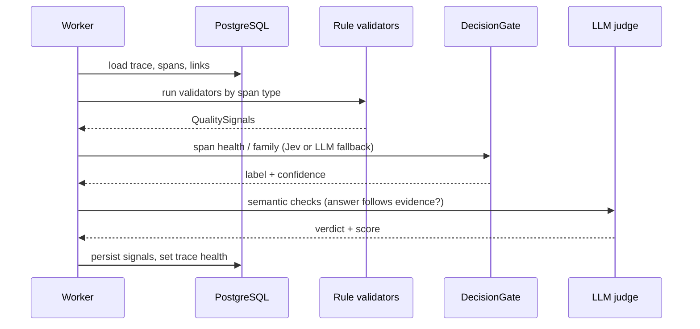
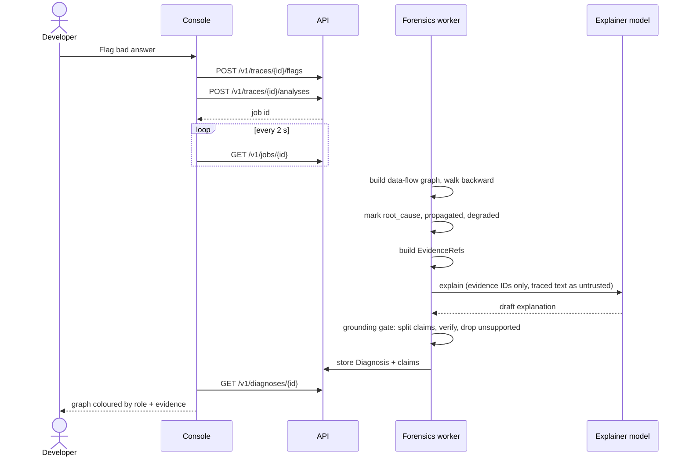
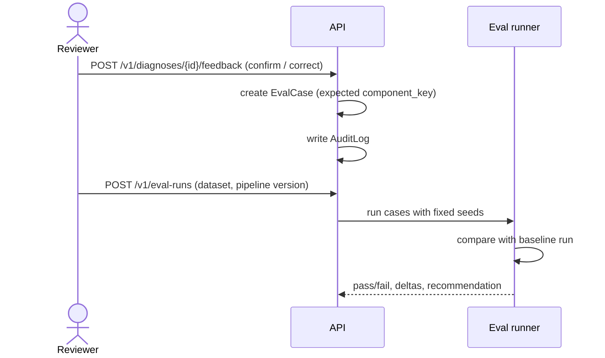

# Sequence Diagrams

## 1. Ingest a trace

```mermaid
sequenceDiagram
  participant App as AI app + SDK
  participant API as Ingestion API
  participant PG as PostgreSQL
  participant S3 as MinIO
  participant Q as Celery
  App->>App: span(), set_output(), inputs_from=[...]
  App->>App: redact secrets, batch (100 spans or 1 s)
  App->>API: POST /v1/ingest/batch (API key)
  API->>API: validate schema, size limits, redact again
  API->>S3: store payloads > 8 KB
  API->>PG: upsert trace, spans, links (idempotent)
  API-->>App: 202 Accepted
  App->>API: POST /v1/traces/{id}/complete
  API->>Q: enqueue assembly + detection
```

## 2. Detection

```mermaid
sequenceDiagram
  participant Q as Worker
  participant PG as PostgreSQL
  participant R as Rule validators
  participant DG as DecisionGate
  participant J as LLM judge
  Q->>PG: load trace, spans, links
  Q->>R: run validators by span type
  R-->>Q: QualitySignals
  Q->>DG: span health / family (Jev or LLM fallback)
  DG-->>Q: label + confidence
  Q->>J: semantic checks (answer follows evidence?)
  J-->>Q: verdict + score
  Q->>PG: persist signals, set trace health
```

## 3. Flag, analyze and diagnose

```mermaid
sequenceDiagram
  actor Dev as Developer
  participant UI as Console
  participant API as API
  participant W as Forensics worker
  participant LLM as Explainer model
  Dev->>UI: Flag bad answer
  UI->>API: POST /v1/traces/{id}/flags
  UI->>API: POST /v1/traces/{id}/analyses
  API-->>UI: job id
  loop every 2 s
    UI->>API: GET /v1/jobs/{id}
  end
  W->>W: build data-flow graph, walk backward
  W->>W: mark root_cause, propagated, degraded
  W->>W: build EvidenceRefs
  W->>LLM: explain (evidence IDs only, traced text as untrusted)
  LLM-->>W: draft explanation
  W->>W: grounding gate: split claims, verify, drop unsupported
  W->>API: store Diagnosis + claims
  UI->>API: GET /v1/diagnoses/{id}
  UI-->>Dev: graph coloured by role + evidence
```

## 4. Review and regression

```mermaid
sequenceDiagram
  actor Rev as Reviewer
  participant API as API
  participant E as Eval runner
  Rev->>API: POST /v1/diagnoses/{id}/feedback (confirm / correct)
  API->>API: create EvalCase (expected component_key)
  API->>API: write AuditLog
  Rev->>API: POST /v1/eval-runs (dataset, pipeline version)
  API->>E: run cases with fixed seeds
  E->>E: compare with baseline run
  E-->>API: pass/fail, deltas, recommendation
```
